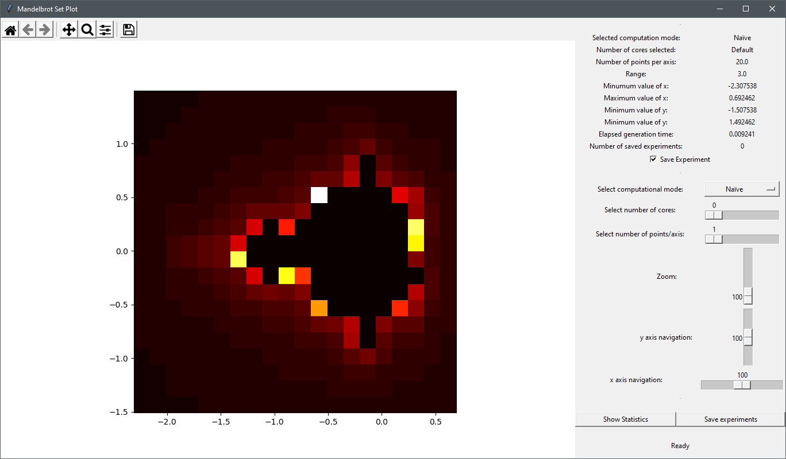
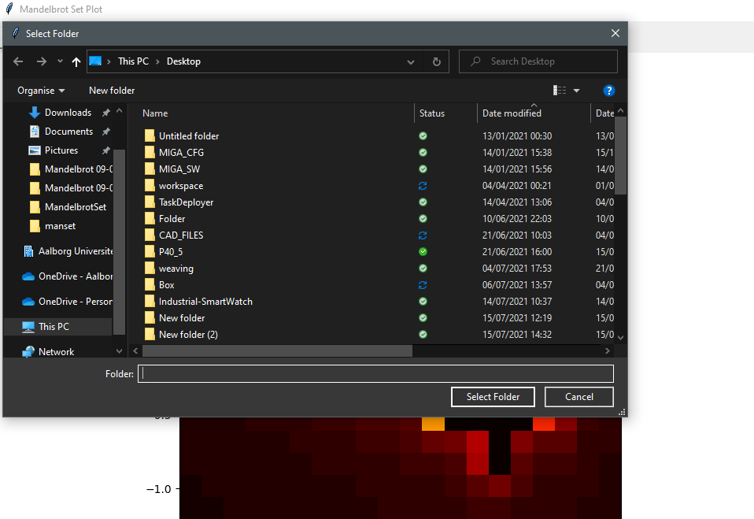
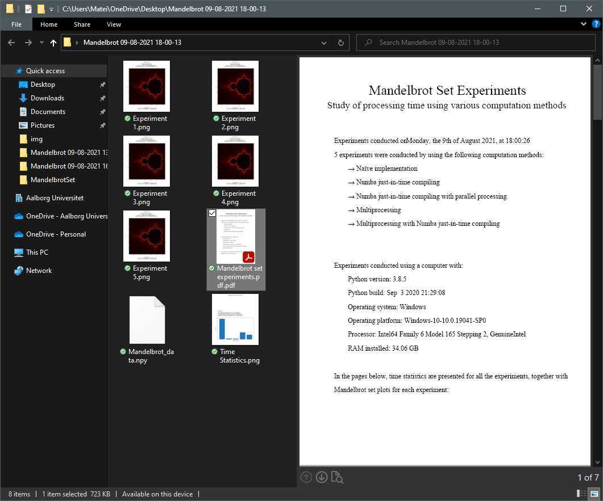

# MandelbrotSet

 

Navigating the beatiful Mandelbrot set graphical representation can be a hard task for a computer without the proper computation tools. The graphical user interface proposed in this packege allows the user to navigate the Mandelprot set along the imaginary and the real axis of the complex plane while at the same time being able to zoom in and out to observe the patterns obtained while narrowing down the value range.

There are five possible computation methods from which the user can select from:

* Naïve method, where a pure python implementation is used
* JIT, a faster method using the Numba just-in-time compiler
* JIT parallel, method using Numba just-in-time compiler with parallel computing
* MultiProc, method using the multi processing technique, where the user can select the number of cores they want to use for performing the mandelbrot computations
* MultiProc JIT, just like MultiProc, but also using Numba just-in-time compiler

# Installation

## Option 1 
a) In an anaconda terminal execute (you may want to use a virtual environment <see b)>):

    >conda install -c mateisarivan -c conda-forge manset

b) To cleanly remove the installed package use:

    >conda create -n manset_env
    >conda activate manset_env
    >conda install -c mateisarivan -c conda-forge manset

## Option 2 
Clone git repository MateiSarivan/MandelbrotSet using

    >git clone https://github.com/MateiSarivan/MandelbrotSet.git

Afterwards change directory to get inside the cloned repository E.g.:

    >cd path\to\cloned\repository\MandelbrotSet 
Install the package:

    >python setup.py install

# Navigating and saving the complex plane

In your terminal execute:

    >manset

  

This will open the gui window of the mandelbrot set navigator software. On the left hand side of the window, the mandelbrot set plot can be observed (***visual output***). On the right hand side of the window, navigation controls and information about the plotted values are available (***user input***).

The default computation mode with which the software starts is selected to be the naïve one which is also the slowest. The user can change this computation methods by using the dropdown menu labeled "***Select computation method***". The user can choose one of the five computation methods mentioned above. When selecting one of the multiprocessing options, the number of cores used in the experiment can be adjusted by using the slider labeled ***Select number of cores***. The slider can take values from ***0*** up to the maximum of cores available on the machine (including logical cores for Intel CPUs). If value ***0*** is selected, the default value *ProcessPoolExecutor* is used. 

The plot of the Mandelbrot set can be refined by using the slider labeled ***Select number of points/axis***, which is set by default to only 20 points per axis. By increasing the value, the computations time increases too; and depending on the selected computation method and the machine, it can take a long time to plot an image with 10000 points per axis, for example. 

The sliders labeled ***zoom***, ***y axis navigation*** and ***x axis navigation*** control the navigation of the plot by modifing the minimum and the maximum value of the *x* and *y* coordinates on the real and the imaginary axes of the real plane. Since the Mandelbrot set is computed at run time, the zoom amount does not interfere with the quality of the plot as it is customary with similar applications. Howeer, the quality of the plot is directly impacted by the selected number of points per axis.

Everytime the user makes a change using the GUI controls available, a new "***experiment***" is generated and saved in memory, while all the information about the experiment is displayed on the right hand side. 

Experiment saving can be enabled or disabled by ticking or unticking the checkbox labeled "***Save Experiment***". The number of saved experiments is displayed at the bottom of the information list. The maximum number of experiments which are allowed to be saved in one session is 20. Time benchmarks are provided by clicking the ***Show statistics*** button. 

A bar plot is generated in a new window with the time expressed in seconds elapsed for each experiment on the *y* axis and the experiment number on the *x* axis. On the right hand side of the new window, data about each experiment is given (experient number, computation method, number of cores, number of points per axis). When clicking on an experiment in the list, further info is given (min/max value of x and y, value range).

Saving the experiments on the data storage drive is possible by clickig the button labeled "***Save experiments***".

  

The user is prompted to pick a folder where the expriments should be saved. Once a folder is picked by the user, a new folder is created named "Mandelbrot DD-MM-YY HH-MM-SS" (current date and time at the moment of creation).

  

The created folder contains the following files:

* .png files of the Mandelbrot plot of each experiment
* .png file of the time statistics for the whole saved session
* .pdf file containing meta data about the experiment session: data about the machine which was used, how many experiments were performed during the session, the computation methods used, and the time and date of the experiment together with plots and time statistics
* .npy file containing the data structure of the experiment session as follows:

        experiment_session = [
            experiment_0 = {
                    "elapsed_time": time elapsed for the experiment computation (float)
                    "computation_method": the method used for computation (string)
                    "number of cores": number of cores used for computation, where appliable (string)
                    "range": the value range between x|y minimum and z|y maximum (float)
                    "min_x": minimum value of x (float)
                    "max_x": maximum value of x (float)
                    "min_y": minimum value of y (float)
                    "max_y": maximum value of x (float)
                    "no_points": number of points plotted per axis (int)
                    "result": a numpy mesh with shape [no_points x no_points] (numpy array of floats)
                }
            experiment_1 = {...}
            .
            .
            .
            experiment_19 = {...}
            
            ]

