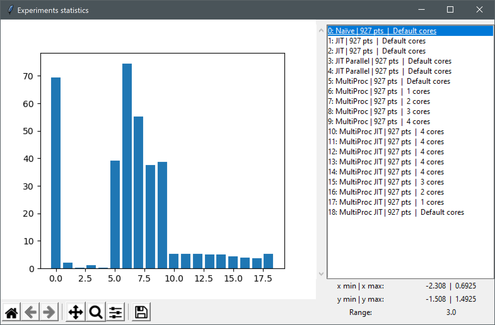
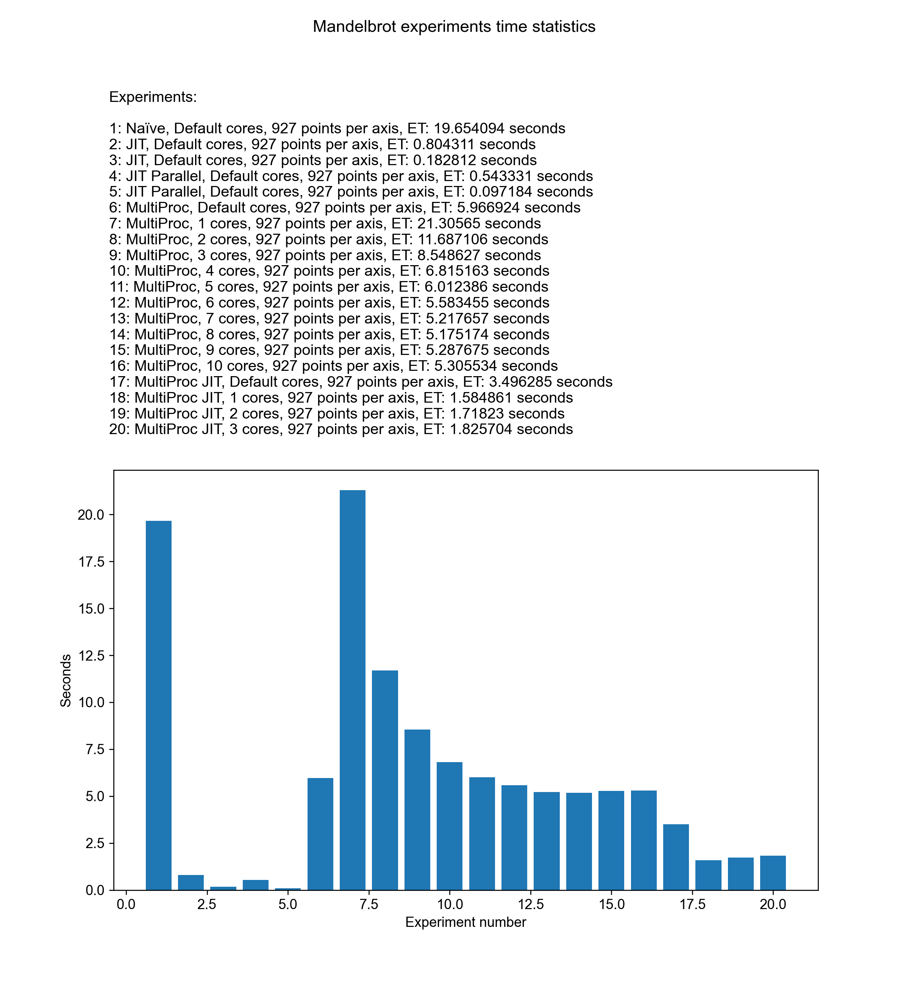
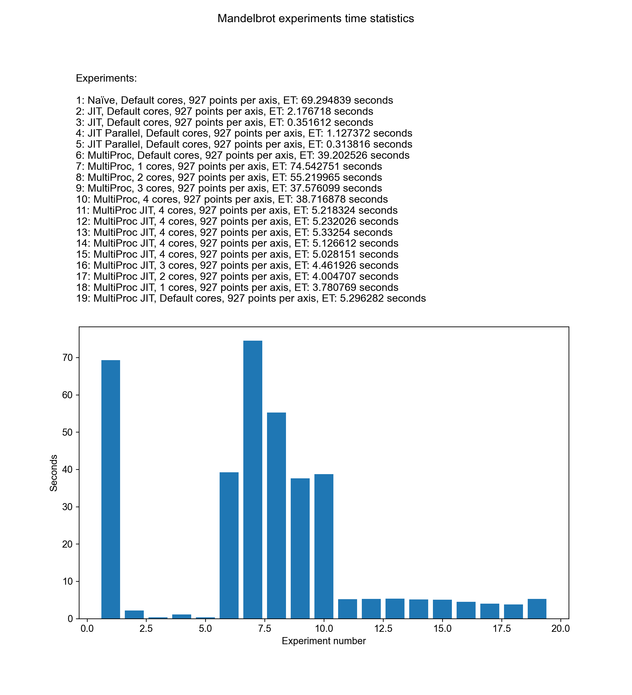

# MandelbrotSet

 

Navigating the beatiful Mandelbrot set graphical representation can be a hard task for a computer without the proper computation tools. The graphical user interface proposed in this packege allows the user to navigate the Mandelprot set along the imaginary and the real axis of the complex plane while at the same time being able to zoom in and out to observe the patterns obtained while narrowing down the value range.

There are five possible computation methods from which the user can select from:

* Naïve method, where a pure python implementation is used
* JIT, a faster method using the Numba just-in-time compiler
* JIT parallel, method using Numba just-in-time compiler with parallel computing
* MultiProc, method using the multi processing technique, where the user can select the number of cores they want to use for performing the mandelbrot computations
* MultiProc JIT, just like MultiProc, but also using Numba just-in-time compiler

# Installation

It is assumed the latest conda and python versions are used.

## Option 1

a) In an anaconda terminal execute (you may want to use a virtual environment <see b)>):

    >conda install -c mateisarivan -c conda-forge manset

b) To cleanly remove the installed package use:

    >conda create -n manset_env
    >conda activate manset_env
    >conda install -c mateisarivan -c conda-forge manset

## Option 2

Clone git repository MateiSarivan/MandelbrotSet using

    >git clone https://github.com/MateiSarivan/MandelbrotSet.git

Afterwards change directory to get inside the cloned repository E.g.:

    >cd path\to\cloned\repository\MandelbrotSet 
Install the package:

    >python setup.py install

# Navigating and saving the complex plane

In your terminal execute:

    >manset

  

This will open the gui window of the mandelbrot set navigator software. On the left hand side of the window, the mandelbrot set plot can be observed (***visual output***). On the right hand side of the window, navigation controls and information about the plotted values are available (***user input***).

The default computation mode with which the software starts is selected to be the naïve one which is also on of the slowest. The user can change this computation methods by using the dropdown menu labeled "***Select computation method***". The user can choose one of the five computation methods mentioned above. When selecting one of the multiprocessing options, the number of cores used in the experiment can be adjusted by using the slider labeled ***Select number of cores***. The slider can take values from ***0*** up to the maximum of cores available on the machine (including logical cores for Intel CPUs). If value ***0*** is selected, the default value *ProcessPoolExecutor* is used.

The plot of the Mandelbrot set can be refined by using the slider labeled ***Select number of points/axis***, which is set by default to only 20 points per axis. By increasing the value, the computations time increases too; and depending on the selected computation method and the machine, it can take a long time to plot an image with 10000 points per axis, for example.

The sliders labeled ***zoom***, ***y axis navigation*** and ***x axis navigation*** control the navigation of the plot by modifing the minimum and the maximum value of the *x* and *y* coordinates on the real and the imaginary axes of the real plane. Since the Mandelbrot set is computed at run time, the zoom amount does not interfere with the quality of the plot as it is customary with similar applications. Howeer, the quality of the plot is directly impacted by the selected number of points per axis.

Everytime the user makes a change using the GUI controls available, a new "***experiment***" is generated and saved in memory, while all the information about the experiment is displayed on the right hand side.

Experiment saving can be enabled or disabled by ticking or unticking the checkbox labeled "***Save Experiment***". The number of saved experiments is displayed at the bottom of the information list. The maximum number of experiments which are allowed to be saved in one session is 20. Time benchmarks are provided by clicking the ***Show statistics*** button.

  

A bar plot is generated in a new window with the time expressed in seconds elapsed for each experiment on the *y* axis and the experiment number on the *x* axis. On the right hand side of the new window, data about each experiment is given (experient number, computation method, number of points per axis, and number of cores used). When clicking on an experiment in the list, further info is given (min/max value of x and y, value range).

As observed in the bar plot, the slowest computation method is the multiprocessing using one core only, taking over 70 seconds to compute for 927 points per axis on a *Windows 10* machine with processor *Intel64 Family 6 Model 78 Stepping 3, GenuineIntel* and 8GB of installed RAM. The fastest computing method is just-in-time compiling with parallel processing by numba. To be observed that two tests were made with just-in-time compiling, parallel and non-parallel. The first of these tests is slower due to numba needing to compile the code in the first run. Tests 6-9 showcase the difference in elapsed computation time when using different core numbers.

Saving the experiments on the data storage drive is possible by clickig the button labeled "***Save experiments***".

  

The user is prompted to pick a folder where the expriments should be saved. Once a folder is picked by the user, a new folder is created named "Mandelbrot DD-MM-YY HH-MM-SS" (current date and time at the moment of creation).

  

The created folder contains the following files:

* .png files of the Mandelbrot plot of each experiment
* .png file of the time statistics for the whole saved session
* .pdf file containing meta data about the experiment session: data about the machine which was used, how many experiments were performed during the session, the computation methods used, and the time and date of the experiment together with plots and time statistics
* .npy file containing the data structure of the experiment session as follows:

        experiment_session = [
            experiment_0 = {
                    "elapsed_time": time elapsed for the experiment computation (float)
                    "computation_method": the method used for computation (string)
                    "number of cores": number of cores used for computation, where appliable (string)
                    "range": the value range between x|y minimum and z|y maximum (float)
                    "min_x": minimum value of x (float)
                    "max_x": maximum value of x (float)
                    "min_y": minimum value of y (float)
                    "max_y": maximum value of x (float)
                    "no_points": number of points plotted per axis (int)
                    "result": a numpy mesh with shape [no_points x no_points] (numpy array of floats)
                }
            experiment_1 = {...}
            .
            .
            .
            experiment_19 = {...}
            
            ]

# Overall software design considerations

This software was designed in order to showcase the benefits of code optimisation when dealing with a high number of iterations and floating point values. To do this, three implementations were required: naïve (using vanilla python and numpy), just-in-time compiling (using numba) and multiprocessing (using concurrent futures). During exprimentation with these methods, it was found out that by making hybrid implementations between just-in-time and multiprocessing, better time results are obtained. Therefore, two more Mandelbrot set computation implementation were added: just-in-time with parallel computing and multiprocessing with just-in-time compiling. All these implementation can be found inside the ***mandelbrot.py*** file.

In terms of optimising the code, it was found out that by applying just-in-time compiling with parallel processing direcly on the naïve version of the implementation, the results were poor. Therefore the just-in-time parallel computing is split in two methods ***divergence_check_jit_parallel*** on which just-in-time compiling with parallel processing is applied; and ***div_check_jit_parallel***, where only just-in-time compiling is applied on the divergence check algorithm. It is proven this way that there are two main parts of the Mandelbrot set computation algorithm: the iteration through the complex plane along the real axis (***range_x*** in code) and the imaginary axis (***range_y*** in code); and the divergence check for each given point, with a number of 100 maximum iterations.

There are a total of six modules inside the ***manset*** package, the ***manset_gui.py*** being the main one, where the graphical user interface of the software is defined. From there, while the user adjusts the mandelbrot set being plotted, the computation methods are called from inside the ***mandelbrot.py*** module. A total of five methods containing the mandelbrot computation methods implementations are defined in this module. The methods are put inside a dictionary for implementation convenience regarding the dropdown menu from where the user selects the desired computation method:

    comp_type = {
        "Naïve": divergence_check_naive,
        "JIT": divergence_check_jit,
        "JIT Parallel": divergence_check_jit_parallel,
        "MultiProc": divergence_check_multi,
        "MultiProc JIT": divergence_check_multi_jit
        }

Each method takes three parameters: two numpy arrays containing floats, which are the sets of real and imaginary values for the c constant which used during the divergence check, an integer, which is the number of cores to be used during the computation, relevant only for the multiprocessing implementations.

# Testing

Pytest suite test was created inside the **tests** folder. The whole software is tested everytime a new version is released and a new commit is sent to GitHub. The status of the test can be checked here: . If green all good, if red, bad bad. Same with the conda label  which indicates the availability of the software on Anaconda.org at: <https://anaconda.org/mateisarivan/manset>

Tests are ceated for all five computation implementations. The output is compared with an inital mesh which is sure to be good. The initial mesh is stored inside the ***Mandelbrot_test_data.npy*** file. A gui test is implemented as well, which makes sure that the GUI can be rendered. The tests are currently working only for Windows 10 enviroenments with Python 3.8 or greater. However, versions are built for Linux, Windows and OSX when uploaded to Anaconda.org .

# Profiling and benchmarking

A number of experiments were made using two machines:

* Lenovo P15, Intel I9 10th GEN: *Windows 10* machine with processor *Intel64 Family 6 Model 165 Stepping 2, GenuineIntel* and 34GB of installed RAM (left image below)
* Dell XPS13, Intel I7 6th GEN: *Windows 10* machine with processor *Intel64 Family 6 Model 78 Stepping 3, GenuineIntel* and 8GB of installed RAM (right image below)

  
  

Obviously, the Dell machine is dwarfed by the Lenovo one in terms of generating the plots fast. It can be observed that for the Lenovo machine, the most optimal core number selection for the multiprocessing implementation is 8 cores. When more than 8 cores are selected, the logical cores (virtual) kick in, thus increasing the computation time. In the case of the Dell machine, 3 cores appears to be the optimal selection. Regarding the mltiprocessing just-in-time implemtation, using one core only appears to be the optimal selection for both machines. The just-in-time parallel implementation is the fastest for both machine as long as the first iteration is not considered (however, even the first iteration is faster than the other methods too).
These results are contained inside the ***experiments*** folder of the repository. The .npy files were not added due to 100MB GitHub limit/file.

# Some plots

  
  

  
  

# Uninstall

This only works properly if you have used a virtual environemnt. You simply have to delete the environemnt with:

    >conda env remove -n manset_env

If you have not created an environment:

    >conda remove manset

If you have installed using the ***setup.py*** file:

    >pip uninstall manset

All the generated file will remain on your computer.
