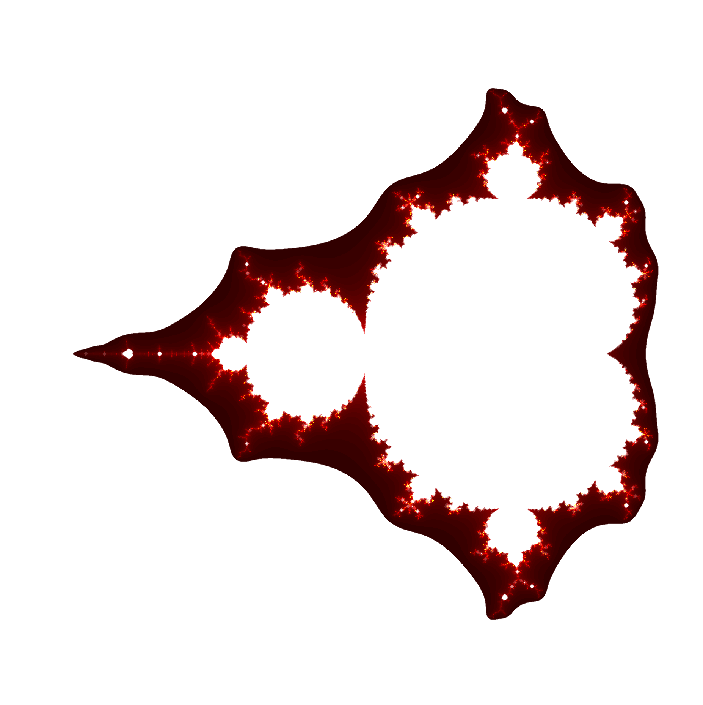

# MandelbrotSet

 

Navigating the beatiful Mandelbrot set graphical representation can be a hard task for a computer without the proper computation tools. The graphical user interface proposed in this packege allows the user to navigate the Mandelprot set along the imaginary and the real axis of the complex plane while at the same time being able to zoom in and out to observe the patterns obtained while narrowing down the value range.

There are five possible computation methods from which the user can select from:

* Naïve method, where a pure python implementation is used
* JIT, a faster method using the Numba just-in-time compiler
* JIT parallel, method using Numba just-in-time compiler with parallel computing
* MultiProc, method using the multi processing technique, where the user can select the number of cores they want to use for performing the mandelbrot computations
* MultiProc JIT, just like MultiProc, but also using Numba just-in-time compiler

# Installation

## Option 1 
a) In an anaconda terminal execute (you may want to use a virtual environment <see b)>):

    >conda install -c mateisarivan -c conda-forge manset

b) To cleanly remove the installed package use:

    >conda create -n manset_env
    >conda activate manset_env
    >conda install -c mateisarivan -c conda-forge manset

## Option 2 
Clone git repository MateiSarivan/MandelbrotSet using

    >git clone https://github.com/MateiSarivan/MandelbrotSet.git

Afterwards change directory to get inside the cloned repository E.g.:

    >cd path\to\cloned\repository\MandelbrotSet 
Install the package:

    >python setup.py install

# Navigating the complex plane

In your terminal execute:

    >manset

  

This will open the gui window of the mandelbrot set navigator software. On the left hand side of the window, the mandelbrot set plot can be observed. On the right hand side of the window, navigation controls and information about the plotted values are available. 